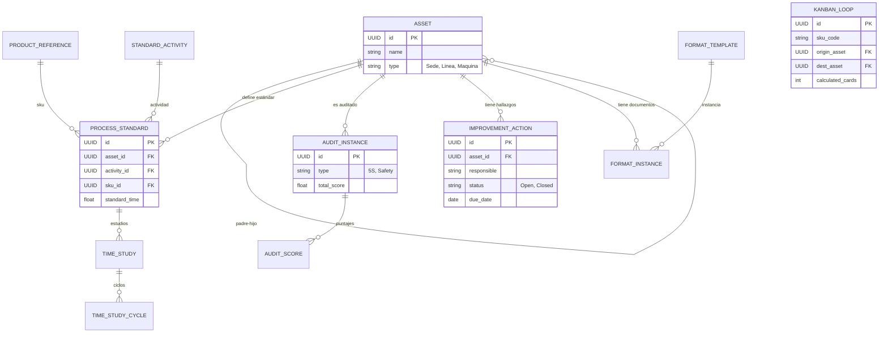

# Documentación Visual de Arquitectura Takta (OAC-SEO)

Este documento centraliza los diagramas estructurales, de datos y funcionales del sistema, complementando los planes técnicos y de formatos.

---

## 1. Diagrama Entidad-Relación (ERD) - Modelo Profundo

Representación gráfica del modelo implementado en `backend/app/models.py`.



---

## 2. Mapa de Arquitectura del Sistema

Vista de alto nivel de los componentes, protocolos y flujo de datos.

```mermaid
graph TD
    subgraph "Cliente (Navegador / Tablet)"
        UI[Frontend SPA]
        ED[Editor.js (Docs)]
        VSM[VSM Canvas (SVG)]
        APP[Action Tracker Dashboard]
    end

    subgraph "Servidor de Aplicaciones (10.252.0.134)"
        API[FastAPI Backend :9003]
        subgraph "Servicios Internos"
            AUTH[Auth Core]
            ENG[Engine Ingeniería]
            ACT[Gestor de Acciones]
            AUD[Motor Auditoría]
        end
    end

    subgraph "Persistencia"
        DB[(SQL Server: Takta)]
    end

    UI -- REST --> API
    ED -- JSON Doc --> API
    APP -- Status Update --> API

    API --> ENG
    API --> ACT
    API --> AUD

    ENG --> DB
    ACT --> DB
    AUD --> DB
```

---

## 3. Mapeo de Módulos Funcionales

### A. Módulo Ingeniería (`/api/engineering`)
*   **Gestión de Estándares**: CRUD de `ProcessStandard`.
*   **Calculadora de Tiempos**: Recepción de ciclos, eliminación de outliers (estadístico), cálculo de T. Normal y Estándar.
*   **Balanceo**: Algoritmos de carga de trabajo vs Takt Time.

### B. Módulo Mejora Continua (`/api/ci`)
*   **Action Tracker**: Dashboard centralizado de tareas (`ImprovementAction`). Permite ver tareas originadas en Kaizens, 5S o Auditorías en una sola lista.
*   **VSM Data**: Gestión de estados actual y futuro.

### C. Módulo Auditorías (`/api/audits`)
*   **5S & Calidad**: Ingesta de auditorías con checklist.
*   **Scoring**: Cálculo automático de puntajes y generación de históricos para gráficos de Radar.

### D. Módulo Logística (`/api/logistics`)
*   **Kanban Designer**: Calculadora de loops (Demanda * Lead Time).
*   **Supermercados**: Definición de carriles (Largo, Ancho) y capacidad.

### E. Módulo Documental (`/api/documents`)
*   **Template Engine**: Inyección de variables en Markdowns (`{{asset_name}}`).
*   **Repositorio**: Guardado y versionamiento de `FormatInstance`.
