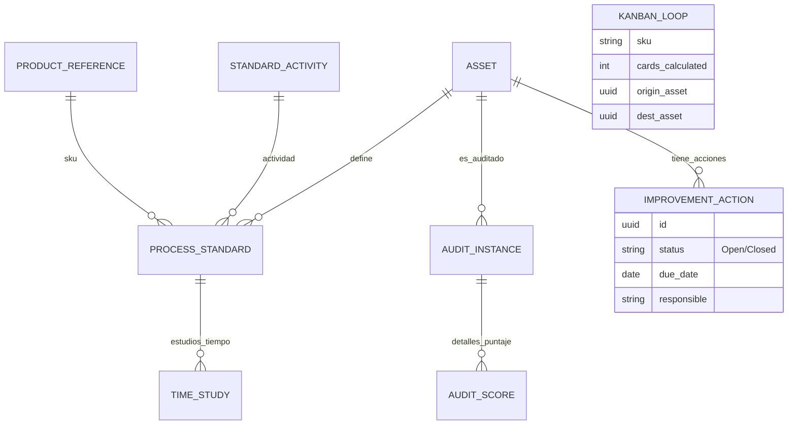

# T03 - Especificación de Requerimientos

## Información del Proyecto

| Campo | Valor |
|-------|-------|
| **ID App** | APP-SEO-01 |
| **Nombre** | Sistema de Estandarización Operativa (OAC-SEO) |
| **Versión Doc** | 1.0 |
| **Fecha** | 2026-01-22 |
| **Autor** | Daniel Castaneda |

---

## 1. Introducción

### 1.1 Propósito
El propósito del sistema OAC-SEO es proporcionar una plataforma centralizada para la gestión, estandarización y optimización de los procesos operativos en las plantas de beneficio de Operadora Avícola Colombia. Busca eliminar la gestión en papel/Excel desacoplada y habilitar la toma de decisiones basada en datos reales de métodos y tiempos.

### 1.2 Alcance
El sistema abarcará desde la definición de la estructura de planta (Activos) hasta la ejecución de auditorías de estándares (5S, SOPs). Incluye módulos de Ingeniería de Métodos, Estudio de Tiempos, Balanceo de Líneas y Visualización de Procesos.

### 1.3 Definiciones
| Término | Definición |
|---------|------------|
| **SOP** | Standard Operating Procedure (Procedimiento Operativo Estándar). |
| **VSM** | Value Stream Mapping (Mapeo de Flujo de Valor). |
| **Takt Time** | Ritmo de la demanda del cliente (Tiempo disponible / Demanda). |
| **Tiempo Ciclo** | Tiempo real que toma completar una unidad de trabajo. |
| **Muda** | Terminología Lean para "Desperdicio" (actividad que no agrega valor). |

---

## 2. Requerimientos Funcionales

### RF-001: Gestión de Jerarquía de Activos
- **Descripción**: El sistema debe permitir crear, editar y visualizar la estructura de la planta en forma de árbol (nodos padres e hijos).
- **Prioridad**: Alta
- **Criterios de aceptación**:
  - [ ] El usuario puede definir nodos raíz (Sedes).
  - [ ] Se pueden anidar niveles ilimitados (Zona > Línea > Máquina > Puesto).
  - [ ] Visualización clara de dependencias.

### RF-002: Digitalización de SOPs
- **Descripción**: Módulo para la redacción y gestión de versiones de Procedimientos Operativos Estándar.
- **Prioridad**: Alta
- **Criterios de aceptación**:
  - [ ] Editor de texto enriquecido para redactar pasos.
  - [ ] Capacidad de adjuntar imágenes/diagramas a cada paso.
  - [ ] Control de versiones y flujo de aprobación.

### RF-003: Cronometraje Digital y Cálculo de Estándares
- **Descripción**: Herramienta para registrar tomas de tiempos (ciclos) asociados a una Actividad realizada sobre una Referencia específica.
- **Prioridad**: Alta
- **Criterios de aceptación**:
  - [ ] Selección de Referencia (SKU) y Actividad previo al cronometraje.
  - [ ] Interfaz de toma de tiempos (Cronómetro digital en pantalla).
  - [ ] Cálculo automático de Tiempo Normal y Estándar dado un % de suplementos.
  - [ ] Asociación de tiempos a combinaciones únicas Activo-Actividad-Referencia.

### RF-004: Gestión de Actividades y Referencias
- **Descripción**: Administración del catálogo de SKUs y lista maestra de actividades estándar.
- **Prioridad**: Alta
- **Criterios de aceptación**:
  - [ ] ABM de Referencias (Código, Descripción, Familia).
  - [ ] ABM de Actividades Estándar (Nombre, Tipo: Valor Agregado/No Agregado/Nec.).
  - [ ] Asignación de Actividades permitidas por Tipo de Activo.

### RF-005: Generación Visual de VSM
- **Descripción**: Herramienta gráfica para diagramar el flujo de valor actual y futuro.
- **Prioridad**: Media
- **Criterios de aceptación**:
  - [ ] Librería de iconos Lean (Inventario, Transporte, Proceso, Flechas de flujo).
  - [ ] Cálculo automático de Lead Time total vs. Tiempo de Valor Agregado.
  - [ ] Indicadores visuales de "Estallidos Kaizen" (Oportunidades de mejora).

### RF-006: Action Tracker (Mejora Continua)
- **Descripción**: Módulo centralizado para gestión de tareas derivadas de Kaizen, A3 o Auditorías.
- **Prioridad**: Alta
- **Criterios de aceptación**:
  - [ ] Crear tarea vinculada a un Activo y un Documento Fuente (ej. "Kaizen-01").
  - [ ] Asignación de responsables y fechas límite.
  - [ ] Workflow de estados: Abierto -> En Progreso -> Cerrado -> Verificado.

### RF-007: Auditorías 5S y Calidad
- **Descripción**: Ejecución digital de listas de chequeo con puntuación.
- **Prioridad**: Media
- **Criterios de aceptación**:
  - [ ] Renderizado de checklist dinámico según Template.
  - [ ] Cálculo de puntaje (Scoring) automático.
  - [ ] Generación de gráfico de Radar histórico.

### RF-008: Logística Kanban
- **Descripción**: Herramientas para cálculo de loops y dimensionamiento de supermercados.
- **Prioridad**: Baja (Fase 3)
- **Criterios de aceptación**:
  - [ ] Calculadora de Tarjetas (Demanda * Lead Time).
  - [ ] Generación de PDFs de Tarjetas para impresión.

---

## 3. Requerimientos No Funcionales

### RNF-001: Rendimiento
- Tiempo de carga < 2 segundos para vistas de consulta.
- Soporte para 50 usuarios concurrentes sin degradación perceptible.

### RNF-002: Seguridad
- Autenticación via sistema centralizado (SSO/LDAP si disponible, o JWT Bios Apps).
- Roles: Administrador, Ingeniero de Procesos (Editor), Supervisor (Auditor), Gerencia (Visualizador).

### RNF-003: Disponibilidad
- Horario: 24/7 (Turnos rotativos de planta).
- SLA: 99.5%
- Capacidad Offline (Deseable) para zonas sin cobertura Wifi.

---

## 4. Casos de Uso

### CU-001: Crear Nuevo Estándar de Puesto
| Campo | Valor |
|-------|-------|
| **Actor** | Ingeniero de Procesos |
| **Precondición** | El Puesto de Trabajo debe existir en la Jerarquía de Activos. |
| **Flujo principal** | 1. El usuario navega al activo "Puesto X".   2. Selecciona "Crear SOP".   3. Define los pasos, peligros y EPPs.   4. Guarda la versión Borrador.   5. Solicita aprobación. |
| **Postcondición** | El SOP queda en estado "Pendiente de Aprobación". |

---

## 5. Interfaces

### 5.1 Mockups
> Ver carpeta de diseño o archivo `PROPUESTA_ARQUITECTURA_FRONTEND.md` para referencias estructurales.
> Se debe seguir estrictamente el **Bios Design System** (Colores Petróleo, Botones estándar, Navbar corporativo).

### 5.2 Integraciones
| Sistema | Tipo | Descripción |
|---------|------|-------------|
| **Contadores PLC** | API/IoT | Lectura de unidades producidas para comparar con el estándar teórico. |
| **Directorio Activo** | LDAP | Autenticación de usuarios corporativos. |

---

## 6. Modelo de Datos Relacional (Deep Model)

Modelo expandido para soportar Acción, Auditoría y Kanban.

---

## 7. Aprobación

| Rol | Nombre | Firma | Fecha |
|-----|--------|-------|-------|
| Product Owner | Gerente Ing. Procesos | | |
| Líder Técnico | Líder TD | | |
