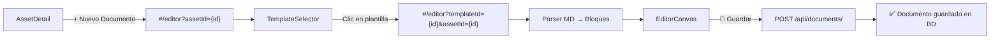

# FASE 2: Motor Documental (Gestión del Conocimiento)

> **Estado**: Completada (MVP) ✅
> **Objetivo**: Digitalizar la creación de documentación (SOPs, LUPs) usando Editor.js.
> **Fecha de Cierre**: 2026-02-24
> **Última Auditoría**: 2026-02-27

---

## 📅 Sprint 3: Backend Documental (Semana 3) ✅

### 🎯 Objetivos
- Sistema de Plantillas (Ingesta de `ie_formats`).
- Almacenamiento de Documentos (JSON Blob).

### 📋 Checklist Técnico

| Tarea | Alcance | Estado |
|-------|---------|--------|
| Modelo `FormatTemplate` + `FormatInstance` | **MVP** | ✅ |
| API Ingesta de templates (`/templates/ingest`) | **MVP** | ✅ |
| API Listar templates por categoría | **MVP** | ✅ |
| API Guardar/Leer documentos JSON | **MVP** | ✅ |
| API Render HTML/Markdown | Full | ⬜ Pendiente |

- **Modelos**:
    - [x] `FormatTemplate`: Estructura base con `code`, `name`, `category`, `markdown_structure`, `json_schema_structure`.
    - [x] `FormatInstance`: Instancia diligenciada con `template_id`, `asset_id`, `user_id`, `content_json`.
- **API (`/api/templates`):**
    - [x] `POST /api/templates/ingest`: Escanea recursivamente `templates/ie_formats`, parsea nombre del H1, categoría del directorio padre, y upserta en BD.
    - [x] `GET /api/templates/`: Lista todos los formatos con metadata.
- **API (`/api/documents`):**
    - [x] `POST /api/documents/`: Guarda JSON de Editor.js vinculado a template + asset.
    - [x] `GET /api/documents/{id}`: Recupera un documento por UUID.
    - [x] `GET /api/documents/asset/{asset_id}`: Lista documentos asociados a un activo (incluye nombre del template vía JOIN).
    - [ ] `GET /api/documents/{id}/render`: Retornar HTML/Markdown. *(Full, pendiente)*
- **🧪 Testing**:
    - [x] Tests de ingestión de templates (`test_templates.py`).
    - [x] Tests de CRUD de documentos (`test_documents.py`).
    - [x] Tests pasando (cobertura funcional de templates + documents).

### 📁 Archivos Implementados

| Archivo | Ruta | Estado |
|---------|------|--------|
| `templates.py` | `backend/app/api/routers/templates.py` | ✅ Verificado |
| `documents.py` | `backend/app/api/routers/documents.py` | ✅ Verificado |
| `test_templates.py` | `backend/tests/test_templates.py` | ✅ Verificado |
| `test_documents.py` | `backend/tests/test_documents.py` | ✅ Verificado |

---

## 📅 Sprint 4: Frontend Editor (Semana 4) ✅

### 🎯 Objetivos
- Integración de Editor.js V2.
- Interfaz de "Nuevo Documento".

### 📋 Checklist Técnico

| Tarea | Alcance | Estado |
|-------|---------|--------|
| Editor.js con plugins core (Header, List, Table, Warning, Delimiter, Quote, Marker, Image) | **MVP** | ✅ |
| Parser Markdown → Bloques Editor.js | **MVP** | ✅ |
| Modal "Seleccionar Tipo de Formato" (Card Grid por categoría) | **MVP** | ✅ |
| Inyección de Template pre-cargado en editor | **MVP** | ✅ |
| Botón "Guardar" flotante con feedback visual | **MVP** | ✅ |
| Inyección de Variables (`{{asset_name}}`) | Full | ⬜ Pendiente |
| Auto-save | Full | ⬜ Pendiente |
| Subida de imágenes (Base64 o endpoint) | Full | ⬜ Pendiente |

- **Infraestructura**:
    - [x] CDN de Editor.js v2.30.8 + 8 plugins inyectados en `index.html`.
    - [x] `editor.config.js`: Configuración centralizada de herramientas + i18n español.
    - [x] `markdownToBlocks.js`: Parser Markdown → Bloques (headers h1-h6, listas, tablas, delimitadores, párrafos).
- **Componentes UI**:
    - [x] `TemplateSelector.js`: Grid de tarjetas agrupadas por categoría (BPM, Lean, TPM, 6S, Kaizen, Kanban). Fetch desde `/api/templates/`.
    - [x] `EditorCanvas.js`: Wrapper Editor.js con cabecera (template name, asset name, botón volver), lienzo de edición, y botón flotante 💾 con estados (saving → success → reset).
    - [x] `DocumentEditorPage.js`: Controlador de página bi-fase (selector → editor) con soporte de query params.
- **Integración**:
    - [x] `router.js`: Soporte para query parameters en hash routing (`?assetId=...&templateId=...`).
    - [x] `main.js`: Ruta `/editor` registrada en router autenticado.
    - [x] `AssetDetail.js`: Botón **+ Nuevo Documento** en cabecera del activo (navega a `#/editor?assetId={id}`).
- **Build**:
    - [x] Vite build funcional (producción).

### 📁 Archivos Creados

| Archivo | Ruta | Estado |
|---------|------|--------|
| `markdownToBlocks.js` | `frontend/src/services/markdownToBlocks.js` | ✅ Verificado |
| `editor.config.js` | `frontend/src/services/editor.config.js` | ✅ Verificado |
| `TemplateSelector.js` | `frontend/src/components/editor/TemplateSelector.js` | ✅ Verificado |
| `EditorCanvas.js` | `frontend/src/components/editor/EditorCanvas.js` | ✅ Verificado |
| `DocumentEditorPage.js` | `frontend/src/pages/DocumentEditorPage.js` | ✅ Verificado |

### 📁 Archivos Modificados

| Archivo | Cambio | Estado |
|---------|--------|--------|
| `index.html` | CDN scripts Editor.js + estilos canvas | ✅ Verificado |
| `router.js` | Query params en hash routing | ✅ Verificado |
| `main.js` | Ruta `/editor` | ✅ Verificado |
| `AssetDetail.js` | Botón `+ Nuevo Documento` | ✅ Verificado |
| `api.client.js` | Base URL corregida a `/api` (proxy Vite) | ✅ Verificado |

### 🔄 Flujo de Creación de Documento

### 🧪 Criterios de Aceptación — Resultado

| Criterio | Resultado |
|----------|-----------|
| Usuario puede crear un SOP desde una plantilla | ✅ |
| El documento guarda el ID del activo correctamente | ✅ |
| Build de producción exitoso | ✅ |

---

## 📌 Items Pendientes (Full Scope)

| Item | Estado | Sprint Sugerido |
|------|--------|-----------------|
| `GET /documents/{id}/render` (HTML/Markdown) | ⬜ Pendiente | Sprint 7+ |
| Inyección de Variables (`{{asset_name}}`) | ⬜ Pendiente | Sprint 7+ |
| Auto-save periódico | ⬜ Pendiente | Sprint 7+ |
| Subida de imágenes | ⬜ Pendiente | Sprint 7+ |

## 📊 Métricas (al cierre de auditoría)

| Métrica | Valor |
|---------|-------|
| Backend tests acumulados | **47 passed** |
| Frontend tests acumulados | **5 passed** |
| Total tests proyecto | **52** |
