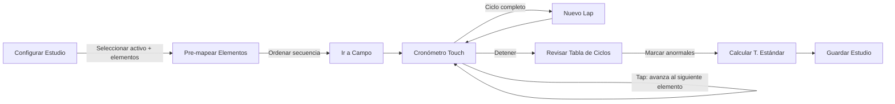

# FASE 3: Motor de Ingeniería (Estándares, Tiempos y Capacidad)

> **Estado**: ✅ Completada (Sprint 5 ✅ — Sprint 5.5 ✅ — Sprint 6 ✅)
> **Última Auditoría**: 2026-02-27
> **Objetivo**: Implementar la lógica matemática para cálculo de Tiempos Estándar (Basado en **Benjamin Nievel**), gestión de la "Triada", Motor de Capacidad Jerárquica, y **Cronómetro Digital Preconfigurable**.

---

## 📅 Sprint 5: Gestión de Estándares (Semana 5) ✅

### 🎯 Objetivos
- CRUD de la "Triada": Activo + Actividad + SKU.
- Catálogos Maestros (Referencias y Actividades).

### 📋 Checklist Técnico

| Tarea | Alcance |
|-------|---------|
| API CRUD de Estándares (POST/GET/PATCH) | **MVP** |
| Vista Catálogo de Referencias | **MVP** |
| Vista Configuración Activo + pestaña Estándares | **MVP** |
| Modal Asignar Actividad (select dependiente) | **MVP** |

- **API (`/api/engineering/standards`)**:
    - [x] `POST`: Crear nuevo estándar (Verificar unicidad). (**MVP**) ✅
    - [x] `GET`: Listar estándares por Activo. (**MVP**) ✅
    - [x] `PATCH`: Activar/Desactivar estándar. (**MVP**) ✅
- **API (`/api/engineering/activities` + `/references`)**:
    - [x] CRUD Actividades con filtro por tipo. (**MVP**) ✅
    - [x] CRUD Referencias (SKU) con búsqueda y unicidad. (**MVP**) ✅
- **Frontend Gestión**:
    - [x] Vista "Catálogo de Referencias": Tabla con búsqueda y creación de SKUs. (**MVP**) ✅
    - [x] Vista "Actividades": Tabla con filtro por tipo. (**MVP**) ✅
    - [x] Vista "Estándares (Triada)": Tabla con filtro por activo + toggle activar. (**MVP**) ✅
    - [ ] Pestaña Estándares dentro del detalle de máquina. (**MVP**) ⬜ Pendiente
    - [ ] Modal "Asignar Actividad": Select dependiente (cascada). (**MVP**) ⬜ Pendiente
- **🧪 Testing**: 11 tests en `test_engineering.py`. **38 tests backend acumulados.**

---

## 📅 Sprint 5.5: Motor de Capacidad y Staffing (Semana 5-6)

> **Nota**: Este sprint se ejecuta en paralelo con Sprint 6 (Cronometraje) dado que
> el `CapacityEngine` ya tiene una implementación base en `backend/app/services/capacity_engine.py`.

### 🎯 Objetivos
- Modelado de Puestos de Trabajo (Manuales/Mecánicos) con capacidad parametrizable.
- Cálculo de Tripulación (Staffing) basado en Demanda vs Takt Time.
- Rollup jerárquico de Capacidad (Máquina → Línea → Área → Planta).

### 📋 Checklist Técnico

| Tarea | Alcance |
|-------|---------|
| Motor de Capacidad (`CapacityEngine`) recursivo | **MVP** ✅ (Implementado) |
| API `/api/capacity/{asset_id}` | **MVP** ✅ (Implementado) |
| Configuración de Puestos (Manual/Mecánico, velocidad, turnos) | **MVP** |
| Frontend: Calculadora de Tripulación (Staffing) | **MVP** |
| Grafos de Precedencia (NetworkX) — Restricciones de secuencia | Full |
| Frontend: Visualización de cuello de botella por línea | Full |

- **Backend Capacidad (`/api/capacity`)**:
    - [x] `CapacityEngine.calculate_asset_capacity()` — Rollup recursivo por Bottleneck. (**MVP** ✅)
    - [x] Endpoint `GET /api/capacity/{asset_id}`. (**MVP** ✅)
    - [ ] Endpoint `GET /api/capacity/{asset_id}/staffing` — Cálculo de personal requerido dado un volumen de demanda. (**MVP**)
    - [ ] Soporte para unidades parametrizables (kg/h, und/h, cajas/h). (**MVP**)
    - [ ] Grafos de Precedencia (`networkx`) para modelar restricciones de secuencia entre puestos. (Full)
- **Frontend Capacidad**:
    - [ ] Vista "Configuración de Puesto": Tipo (Manual/Mecánico), Velocidad, Turnos. (**MVP**)
    - [ ] Calculadora de Tripulación: Input (Demanda diaria, Horas turno) → Output (# Personas). (**MVP**)
    - [ ] Visualización de cuello de botella con semaforización por línea. (Full)

### 🧪 Criterios de Aceptación (Sprint 5.5)
1.  El rollup de capacidad calcula correctamente el bottleneck de una línea con 3+ máquinas.
2.  La calculadora de staffing sugiere un número coherente de operarios dado un volumen de demanda.

---

## 📅 Sprint 6: Cronómetro Digital Preconfigurable y Muestreo (Semana 6)

### 🎯 Objetivos
- **Cronómetro Preconfigurable**: Interfaz de toma de tiempos con actividades/elementos pre-mapeados que permite capturar splits y laps en campo.
- Cálculo estadístico de estándar (Eliminación de outliers).
- Herramienta de Muestreo de Trabajo (Work Sampling).

### 📋 Checklist Técnico

| Tarea | Alcance |
|-------|---------|
| **Modelo `TimingSession` + `TimingLap`** | **MVP** |
| **Configuración de Estudio (pre-mapeo de elementos)** | **MVP** |
| Interfaz cronómetro (Split/Lap/Stop) touch-friendly | **MVP** |
| Contador de Unidades integrado | **MVP** |
| Tabla de ciclos en vivo + marcar Anormal | **MVP** |
| Algoritmo T. Normal y T. Estándar | **MVP** |
| Detección automática outliers | **MVP** |
| Hoja de Cronometraje (PDF/Vista) | Full |
| Muestreo de Trabajo (Productivo vs Improductivo) | Full |

### 🕐 Cronómetro Preconfigurable (Detalle de Diseño)

El cronómetro **no es genérico**: se pre-configura vinculándolo a actividades o elementos de un proceso previamente mapeado. Esto permite que el ingeniero salga a campo con un estudio ya armado y solo presione botones.

#### Modelo de Datos

```
TimingStudy (Estudio de Tiempos)
├── asset_id          → Activo bajo estudio
├── standard_id       → Estándar (Triada) asociado
├── study_type        → 'continuous' | 'snap_back' | 'work_sampling'
├── elements[]        → Lista de ELEMENTOS pre-mapeados
│   ├── name          → "Carga de materia prima"
│   ├── type          → 'manual' | 'machine' | 'transport' | 'delay'
│   ├── is_cyclic     → true/false (¿se repite cada ciclo?)
│   └── order         → Secuencia dentro del ciclo
├── sessions[]        → Sesiones de campo
│   └── laps[]        → Laps capturados
│       ├── element_id
│       ├── split_time_ms
│       ├── lap_time_ms
│       ├── units_count
│       ├── is_abnormal  → boolean (descartado)
│       └── notes
└── config
    ├── rating_factor     → Factor de calificación (0.8 - 1.2)
    ├── supplements_pct   → % Suplementos (fatiga, necesidades)
    └── confidence_level  → 95% | 99%
```

#### Flujo UX



#### Interfaz del Cronómetro (Wireframe)

```
┌──────────────────────────────────────────────┐
│  ← Estudio: Línea Sellado · SKU: Pechuga    │
│  Elemento Actual: [3/5] Inspección Visual    │
├──────────────────────────────────────────────┤
│                                              │
│           ┌─────────────────┐                │
│           │   00:03.472     │  ← Split       │
│           │   ───────────   │                │
│           │   01:23.891     │  ← Acumulado   │
│           └─────────────────┘                │
│    Unidades: [  12  ] [+][-]                 │
│                                              │
├──────────────────────────────────────────────┤
│  ┌──────────┐  ┌──────────┐  ┌────────────┐ │
│  │   LAP    │  │  SPLIT   │  │   STOP     │ │
│  │  (next)  │  │ (same)   │  │  (finish)  │ │
│  └──────────┘  └──────────┘  └────────────┘ │
├──────────────────────────────────────────────┤
│  Ciclo │ Elemento       │ Split  │ Estado   │
│  ──────┼────────────────┼────────┼────────  │
│  1     │ Carga MP       │ 0:04.2 │ ✅       │
│  1     │ Proceso Térmico│ 0:12.1 │ ✅       │
│  1     │ Inspección     │ 0:03.4 │ ⚠️ Anorm│
│  2     │ Carga MP       │ 0:04.0 │ ✅       │
└──────────────────────────────────────────────┘
```

#### Diferencia entre Split y Lap
- **Split**: Marca el tiempo del elemento actual SIN avanzar al siguiente (útil para re-observar el mismo paso).
- **Lap**: Marca el tiempo del elemento actual Y avanza automáticamente al siguiente elemento en la secuencia pre-mapeada. Al completar todos los elementos, se registra un ciclo completo y reinicia la secuencia.

- **Backend**:
    - [ ] Modelo `TimingStudy` con `elements[]` pre-mapeados y `sessions[].laps[]`. (**MVP**)
    - [ ] `POST /api/engineering/studies`: Crear estudio con configuración de elementos. (**MVP**)
    - [ ] `POST /api/engineering/studies/{id}/laps`: Registrar lap individual (tiempo + elemento + unidades). (**MVP**)
    - [ ] `GET /api/engineering/studies/{id}/results`: Cálculo de TN y TE por elemento. (**MVP**)
- **Frontend Cronómetro**:
    - [ ] **Pantalla de Configuración**: Seleccionar activo, elegir/crear elementos del ciclo, definir orden. (**MVP**)
    - [ ] **Pantalla de Captura**: Cronómetro touch-friendly con botones Lap/Split/Stop, indicador de elemento actual, tabla de ciclos en vivo. (**MVP**)
    - [ ] **Contador de Unidades**: Input numérico integrado para conteo de ítems por ciclo. (**MVP**)
    - [ ] Feedback visual: elemento actual resaltado, progreso del ciclo (3/5 elementos), ciclo # actual. (**MVP**)
    - [ ] Marcar "Anormal" en la tabla de ciclos (toca y descarta). (**MVP**)
- **Backend Cálculo (`/api/engineering/calculate`)**:
    - [ ] Algoritmo de T. Normal: `Avg(Ciclos no-anormales) * Rating`. (**MVP**)
    - [ ] Algoritmo de T. Estándar: `TN * (1 + Suplementos)`. (**MVP**)
    - [ ] Detección automática de desviaciones (Ciclos > 2 * Promedio). (**MVP**)
- **Muestreo de Trabajo** (Full):
    - [ ] Interfaz para estudios de frecuencia (Productivo vs Improductivo).
    - [ ] Configuración de intervalos aleatorios de observación.
    - [ ] Cálculo de % de ocupación con intervalo de confianza.
- **Reporte**:
    - [ ] Generación de "Hoja de Cronometraje" (PDF/Vista) con gráfico de ciclos. (Full)

### 🧪 Criterios de Aceptación
1.  El cronómetro funciona sin lag en una tablet de planta (< 16ms por frame).
2.  Un estudio puede pre-configurarse con N elementos y el cronómetro recorre la secuencia automáticamente al presionar "Lap".
3.  El cálculo del estándar excluye automáticamente ciclos marcados como anormales.
4.  El muestreo genera un reporte con % productivo/improductivo y tamaño de muestra requerido. (Full)

---

## 📌 Consideraciones de Transferibilidad (Producción → Servucción)

> El diseño del cronómetro y los estudios de tiempos es **agnóstico del dominio**. Los "elementos" pre-mapeados pueden representar:
> - **Manufactura**: Carga MP, Proceso Térmico, Sellado, Inspección.
> - **Servucción**: Recepción paciente, Triage, Consulta, Registro en sistema.
> - **Logística**: Picking, Verificación, Embalaje, Despacho.
>
> El modelo `TimingStudy.elements[]` no asume un tipo de industria. La abstracción `element.type` usa categorías universales de ingeniería de métodos (operación, transporte, inspección, demora, almacenamiento) aplicables tanto a bienes tangibles como a servicios intangibles.
