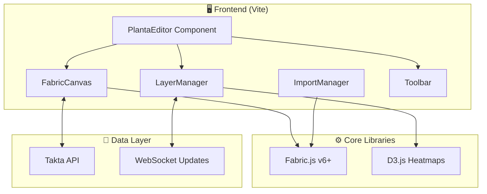
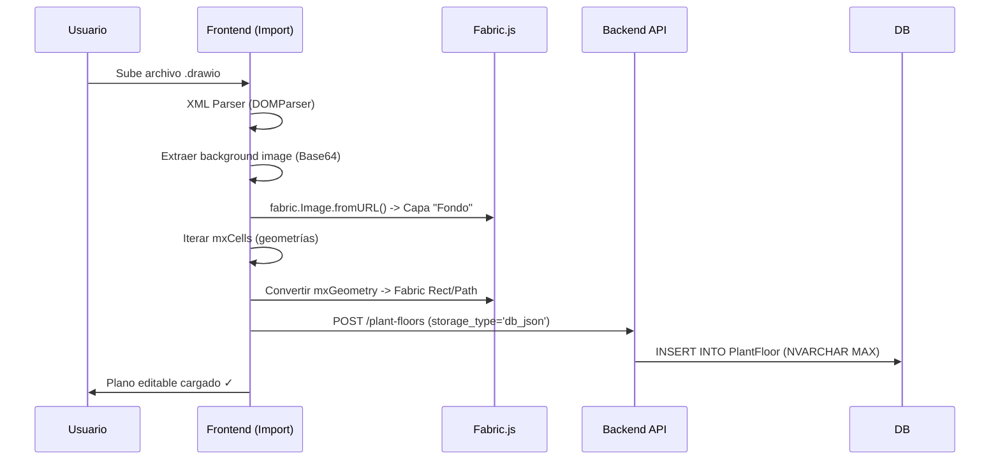

# Plant Floor Editor (PlantaEditor)

> **Versión**: 1.0 Draft  
> **Fecha**: 2026-02-04  
> **Estado**: Especificación de Diseño

---

## 🎯 Objetivo

Editor interactivo de **planos de planta industrial** con soporte de capas funcionales (calor, procesos, estado de activos). Permite importar planos existentes en SVG/JSON y enriquecerlos con datos operativos en tiempo real.

---

## 🧭 Casos de Uso Principales

| Actor | Acción | Resultado |
|-------|--------|-----------|
| **Ingeniero IE** | Importa SVG de planta desde Draw.io | Plano base cargado en canvas |
| **Ingeniero IE** | Dibuja zonas/áreas sobre el plano | Áreas definidas como polígonos editables |
| **Ingeniero IE** | Vincula máquina (shape) con Activo del sistema | Click en máquina → Ficha técnica del activo |
| **Analista** | Activa capa "Mapa de Calor" | Overlay de colores según métrica seleccionada |
| **Supervisor** | Visualiza flujo de proceso | Flechas animadas mostrando recorrido del producto |
| **Sistema** | Actualiza datos en tiempo real | Colores/iconos cambian sin recargar página |

---

## 🏗️ Arquitectura Propuesta



---

## 🔧 Stack Técnico

| Componente | Tecnología | Justificación |
|------------|-----------|---------------|
| **Canvas Engine** | **Fabric.js v6+** | Object model, serialization JSON, SVG import/export, zoom/pan, grouping |
| **Heatmaps** | **D3.js + Canvas overlay** | Interpolación de datos georeferenciados |
| **State Management** | Vanilla JS + EventEmitter | Simplicidad, sin dependencias extras |
| **Real-time** | WebSocket (opcional) | Actualización de métricas sin refresh |

### ¿Por qué Fabric.js?
1.  **SVG ↔ Canvas bidireccional**: Importa SVG, edita en canvas, exporta de vuelta.
2.  **Modelo de Objetos**: Cada shape es un objeto JS manipulable (move, scale, rotate, select).
3.  **Serialización JSON**: Guardar/cargar estado completo del canvas.
4.  **Eventos**: Click, hover, drag en cada objeto.
5.  **Grupos y Capas**: Agrupar elementos lógicamente.
6.  **Zoom/Pan**: Viewport transformations nativas.
7.  **Licencia MIT**: 100% compatible con Open Source.

---

## 📐 Modelo de Datos

### PlantFloor (Documento Principal)
```typescript
interface PlantFloor {
    id: string; // UUID
    name: string;
    asset_id: string; // Activo padre
    // Persistencia Configurable:
    // A. MSSQL (JSON Storage): canvas_json serializado en columna NVARCHAR(MAX)
    // B. Blob Storage (S3/Azure): URL al archivo JSON
    // C. File System: Ruta relativa
    storage_type: 'db_json' | 'blob' | 'file'; 
    canvas_json?: object; 
    canvas_url?: string;
    
    layers: Layer[];
    version: number;
    created_at: Date;
    updated_at: Date;
}
```

### Layer (Capa Funcional)
```typescript
interface Layer {
    id: string;
    name: string;               // "Plano Base", "Zonas", "Mapa Calor", "Flujo"
    type: 'base' | 'zones' | 'heatmap' | 'flow' | 'custom';
    visible: boolean;
    locked: boolean;
    opacity: number;            // 0.0 - 1.0
    data_source?: string;       // API endpoint para datos dinámicos
}
```

---

## 🎨 Diseño UX/UI

### Wireframe Conceptual

```
┌─────────────────────────────────────────────────────────────────┐
│  [← Back] │ Planta Pereira - Editor                    [💾][📤] │ <- Header
├───────────┼─────────────────────────────────────────────────────┤
│           │                                                      │
│  CAPAS    │                                                      │
│  ───────  │                                                      │
│  ☑ Base   │              ┌─────────────────────┐                │
│  ☑ Zonas  │              │                     │                │
│  ☐ Calor  │              │   [CANVAS AREA]     │                │
│  ☐ Flujo  │              │                     │                │
│           │              │   Pan/Zoom enabled  │                │
│  ───────  │              └─────────────────────┘                │
│  HERRAM.  │                                                      │
│  ───────  │                                                      │
│  [✋] Pan  │  ────────────────────────────────────────────────── │
│  [⬜] Rect │  Properties: [Shape: Machine-01] [Asset: SEL-001]  │ <- Inspector
│  [⭕] Circ │                                                      │
│  [📍] Pin  │                                                      │
└───────────┴─────────────────────────────────────────────────────┘
```

## 🔄 Importación Draw.io (mxGraph)

> [!NOTE]
> Análisis de `Diseño de planta por capas.drawio`:
> - Formato: XML estándar de mxGraph.
> - Contenido: Imagen de fondo en Base64 (`<mxCell ... style="shape=image;image=data:image/png..." />`).
> - Estrategia: Extraer la imagen base y reconstruir la geometría de las capas superpuestas.



---

## 📋 Fases de Implementación

### Fase 1: Core Canvas & Persistencia (Sprint 1)
- [ ] Inicializar Fabric.js 6.x
- [ ] **Implementar Strategy Pattern para persistencia**:
    - `MSSQLAdapter`: Para GrupoBios (Directo en DB)
    - `JSONFileAdapter`: Para Community (Sistema de archivos/Blob)
- [ ] CRUD básico de PlantFloor

### Fase 2: Motor de Importación (Sprint 2)
- [ ] Parser XML para leer `.drawio`
- [ ] Extracción y optimización de imágenes Base64 embebidas
- [ ] Conversión de coordenadas mxGraph -> Fabric.js

### Fase 3: Sistema de Capas y Herramientas (Sprint 2-3)
- [x] LayerManager (UI y Lógica)
- [x] Toolbar de herramientas vectoriales
- [ ] Inspector de propiedades (`PropertiesPanel.js`)
- [ ] **Capas Funcionales**:
    - `base`: Plano de fondo (locked, no editable)
    - `zones`: Áreas de zonificación (rectángulos/polígonos parametrizables)
    - `assets`: Máquinas/puestos de trabajo vinculados a IDs del sistema
    - `connections`: Flechas de flujo entre contenedores
- [ ] **Objetos Parametrizables**: Metadata (layerId, assetId, zoneType) y edición.
- [x] **Arrows Dinámicos**: Conexiones que siguen a los objetos.
- [ ] **Parámetros de Conexión**: Arrows con metadata (tipo de flujo, capacidad, etiqueta).

### Fase 3.5: Usabilidad Avanzada (Sprint 3)
- [ ] **Context Menu**: Menú click derecho (Delete, Send to Back/Front, Properties).
- [ ] **Atajos de Teclado**: 
    - `Ctrl+C` / `Ctrl+V`: Copy/Paste
    - `Ctrl+Z` / `Ctrl+Y`: Undo/Redo
    - `Arrows`: Nudge objects
    - `Delete`: Eliminar (Listo)
- [ ] **Gestión de Archivos**:
    - Guardar/Cargar JSON local.
    - Exportar como PNG/SVG.
    - Autosave local (localStorage).

### Fase 4: Integración de Datos Reales (Sprint 4)
- [ ] Vinculación Shape <-> Asset ID
- [ ] D3.js Heatmaps superpuestos sobre canvas
- [ ] WebSocket listener para cambios de estado

---

## User Review Required

> [!TIP]
> **Estrategia Aprobada**: Persistencia híbrida.
> - **Enterprise (Bios)**: Usa `canvas_json` en columna `NVARCHAR(MAX)` de SQL Server para integración transaccional.
> - **Community**: Usa archivos JSON referenciados para facilidad de despliegue sin SQL Server.

> [!IMPORTANT]
> **Validación Técnica**: El parser de Draw.io debe manejar la imagen de fondo separada de los vectores para permitir que las capas de datos (calor/flujo) se rendericen ENTRE el fondo y los iconos de máquinas.
