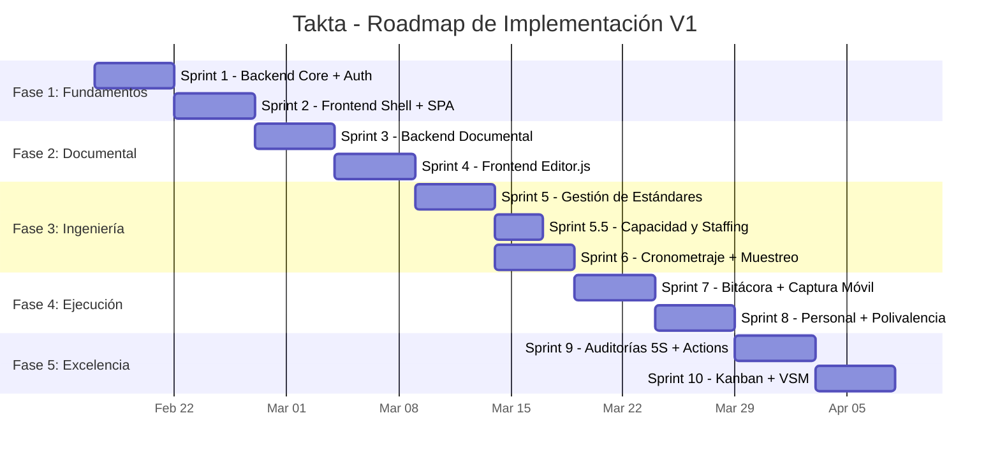

# Plan Maestro de Implementación OAC-SEO

> **Versión**: 3.0 (Consolidación)
> **Fecha**: 2026-02-10
> **Estado**: Planificación Definitiva

Este documento es el **Índice Estratégico**. Para los detalles de ejecución sprint por sprint, consultar los planes de fase específicos vinculados abajo.

---

## 🌍 O. Estrategia Dual (Open Source & Enterprise)
Takta se desarrolla bajo un modelo "Open Core":
1.  **Takta Community (Open Source)**:
    *   **Público**: Ingenieros Industriales, PyMEs, Consultores.
    *   **Diseño**: **TailwindCSS v3.4+** + Glassmorphism (Estética moderna, agnóstica de marca).
    *   **Infraestructura**: Local / On-Premise (SQLite/Postgres). Sin dependencias complejas.
2.  **Takta Enterprise (Grupo Bios)**:
    *   **Público**: Plantas de Operadora Avícola / Grupo Bios.
    *   **Diseño**: **Bios Design System** (Bootstrap 5 + Variables Corporativas).
    *   **Infraestructura**: Windows Server IIS + SQL Server + Azure AD.

### [O.1 Theme Manager System](THEME_MANAGER.md)
Sistema de gestión de temas que permite alternar dinámicamente entre variantes:
- Estrategia Dual: Community (Tailwind) vs Enterprise (Bios DS)
- Layout Wrapper para inyección estructural dinámica.
- Diseño Visual Open Source: `DESIGN_OPENSOURCE.md`
- **Core**: `ThemeManager.js` detecta ambiente y carga CSS correspondiente
- **Community**: TailwindCSS bundled localmente + Glassmorphism
- **Enterprise**: Bios Design System via CDN corporativo (`/Bios_apps/cdn/...`)
- **API**: `TaktaTheme.set('community')`, `TaktaTheme.get()`, `TaktaTheme.detectEnvironment()`
- **Componentes Abstractos**: Clases `.tk-*` que mapean a cada sistema de diseño

## 🏛️ 1. Visión y Alcance (Business Core)

**Objetivo**: Transformar la ingeniería de planta de Operadora Avícola, pasando de "Papel Muerto" a "Datos Vivos".

### 1.1 El Problema
Hoy, un estudio de tiempos o un SOP vive en un Excel o PDF aislado. Si el proceso cambia (ej. nueva máquina), el documento queda obsoleto y desconectado de la realidad productiva.

### 1.2 La Solución Takta
Un ecosistema digital donde:
1.  **El Activo (Máquina/Línea)** es el centro del universo.
2.  **El Estándar** es un dato viviente (Triada: Activo + Actividad + SKU) que "sabe" cuánto debe tardar y cómo debe hacerse.
3.  **La Mejora (Kaizen)** es trazable desde el hallazgo hasta el cierre.
4.  **La Ejecución (Trazabilidad)**: Registro digital en tiempo real de qué pasó, cuándo y quién lo hizo.
5.  **La Inteligencia (Capacidad)**: Modelado flexible de planta (Puestos con/sin máquina) y cálculo dinámico de tripulaciones óptimas.

---

## 🧩 2. Estructura del Proyecto (Roadmap de Fases)

El desarrollo se ha dividido en 5 fases secuenciales para asegurar entregables de valor incremental.

### 📊 Gantt Consolidado



> [!NOTE]
> Sprint 5.5 (Capacidad) se ejecuta en paralelo con Sprint 6 (Cronometraje) dado que
> el `CapacityEngine` ya tiene implementación base. La duración total estimada es **~12 semanas**
> para el alcance MVP, o **~16 semanas** si se incluyen features Full.

---

### [FASE 1: Fundamentos y Datos Maestros](FASE_1_FUNDAMENTOS.md)
> **Semana 1-2**
> Establecimiento del "Sistema Nervioso" del proyecto.
- **Backend**: Configuración FastAPI, SQLModel Recursivo (Árbol de Activos), **JWT Auth Middleware**.
- **Frontend**: Layout Corporativo, Navegador de Planta (Sidebar), SPA Router, **[Editor de Planos Interactivo (PlantaEditor)](PLANT_EDITOR.md)**.
- **Testing**: Setup pytest (backend) + Vitest (frontend).

### [FASE 2: Motor Documental](FASE_2_DOCUMENTAL.md)
> **Semana 3-4**
> Digitalización del "Know-How" (SOPs, LUPs).
- **Backend**: Ingesta de Templates Markdown, Almacenamiento JSON.
- **Frontend**: Integración de **Editor.js**, Renderizado dinámico de formatos.

### [FASE 3: Motor de Ingeniería Avanzada](FASE_3_INGENIERIA.md)
> **Semana 5-6**
> Medición, Estandarización (Metodología Nievel), Capacidad y Modelado de Restricciones.
- **Backend**: Lógica de "Triada", **Motor de Capacidad Jerárquica (Rollup Automático)**, Grafos de Precedencia (NetworkX).
- **Frontend**: Cronómetro Digital (con conteo de unidades), Configuración de Puestos (Manuales/Mecánicos), Calculadora de Tripulación (Staffing), **Muestreo de Trabajo**.

### [FASE 4: Control de Piso y Captura Móvil](FASE_4_EJECUCION.md)
> **Semana 7-8**
> "La Tablet del Analista" y Bitácora de Producción.
- **Backend**: Modelos de Ejecución (`ProductionLog`, `DowntimeEvent`, `Operator`, `OperatorSkill`), API de Registros, Gestión de Personal.
- **Frontend**: Interfaz Móvil (Touch-First), Captura de Paros, **Dictado por Voz (Voice-to-Text)**.

### [FASE 5: Excelencia Operacional](FASE_5_EXCELENCIA.md)
> **Semana 9-10**
> Herramientas de Mejora Continua y Calidad.
- **Backend**: Action Tracker, Scoring de Auditorías, Calculadora Kanban.
- **Frontend**: Canvas VSM interactivo, Gráficos Radar 5S, Tableros Kanban.

---

## 🛠️ 3. Arquitectura Técnica (Referencia)

### Backend (Puerto 9003)
*   **Framework**: FastAPI.
*   **BD**: SQL Server (`Takta`) / SQLite (dev/Community).
*   **Auth**: JWT + Role middleware (`admin`, `engineer`, `supervisor`, `viewer`).
*   **API Modules**: `assets`, `engineering` (Time/Capacity), `execution` (Staff/Logs), `ci`, `audits`, `logistics`, `plant_layouts`.

### Frontend (Dual Strategy)
*   **Open Source**: TailwindCSS v3.4+ + Vanilla JS (Moderno, Ligero).
*   **Enterprise**: Bios Design System (Bootstrap) (Corporativo).
*   **Common Core**: La lógica de negocio JS se comparte donde es posible.
*   **Build Tool**: Vite (HMR en dev, optimized bundle en prod).
*   **Mobile**: PWA / Touch-optimized views for Analysts.
*   **Integraciones Visuales**: Renderizado de Mapas `draw.io` con Capas (Layers) de información (Calor, Estado).
*   Componentes Clave: `AssetTree`, `DocumentEditor`, `VSMCanvas`, `StaffingCalculator`, `PlantMapViewer`.

---

## 🧪 4. Estrategia de Testing

| Capa | Herramienta | Nivel |
|------|-------------|-------|
| **Backend API** | `pytest` + `httpx` (AsyncClient) | Unit + Integration |
| **Frontend** | `Vitest` | Unit (services, utils) |
| **E2E** | Browser subagent / Manual | Flujos críticos |

- **Infraestructura**: BD SQLite en memoria para tests (fixture `conftest.py`).
- **CI**: Ejecutar `pytest` y `vitest run` en cada push.
- **Tests mínimos por sprint**: Cada sprint debe entregar al menos 3 tests de API.

---

## 📦 5. Estrategia de Migración y Seeding

### Datos iniciales (Seed)
| Datos | Fuente | Script |
|-------|--------|--------|
| Sedes y Plantas | Manual | `seed_capacity_data.py` ✅ |
| Catálogo de Actividades | Excel existente | Por crear |
| Catálogo de Referencias (SKU) | **SIESA** via MCP | Endpoint `/api/engineering/sync-references` |
| Templates de Formatos | Carpeta `ie_formats/` | Endpoint `/api/documents/templates/ingest` |

### Migración de datos legacy
- **No hay BD legacy** que migrar directamente.
- Los datos de estándares de tiempo (actualmente en Excel) se cargarán via:
  1. CSV import endpoint (MVP)
  2. Interfaz manual de captura (MVP)

---

## 🚀 6. Estrategia de Deployment

### Community (Open Source)
```bash
# Desarrollo
cd frontend && npm run dev    # Vite HMR en :5173
cd backend && python -m uvicorn app.main:app --reload --port 9003

# Producción
cd frontend && npm run build  # -> dist/
# Servir dist/ con cualquier servidor estático
# Backend con gunicorn/uvicorn
```

### Enterprise (Grupo Bios)
| Componente | Infraestructura | Detalles |
|------------|-----------------|----------|
| **Backend** | Windows Server (10.252.0.134) | IIS → Reverse Proxy → Uvicorn :9003 |
| **Frontend** | Mismo servidor IIS | Carpeta estática `/Bios_apps/Takta/` |
| **BD** | SQL Server | Base `Takta` en instancia corporativa |
| **Auth** | Azure AD / JWT Bios Apps | Integración con SSO corporativo |
| **CI/CD** | `deploy.ps1` | Build + copy → IIS |

---

## ✅ Checklist Global de Éxito
1.  **Centralización**: Todo formato vive en la App, vinculado a un Activo.
2.  **Interconexión**: Auditoría 5S -> Crea Tarea -> Tarea se cierra -> Actualiza KPI.
3.  **Usabilidad**: Carga del Árbol < 1s.
4.  **Seguridad**: Todo endpoint protegido por JWT. Roles aplicados.
5.  **Testabilidad**: `pytest` pasa en CI para cada sprint entregado.

