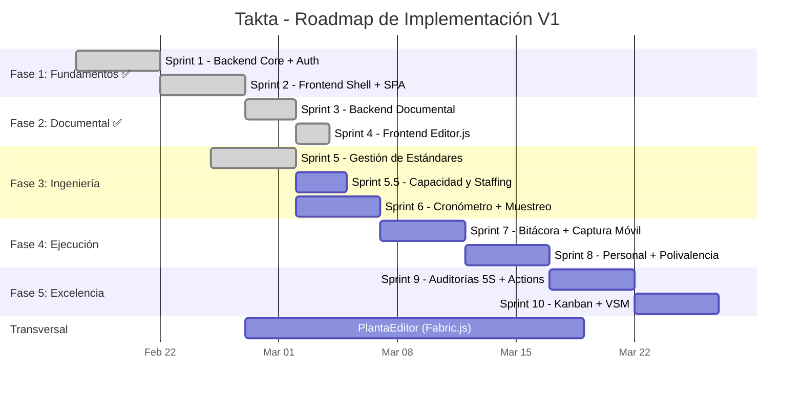

# Plan Maestro de Implementación — Takta

> **Versión**: 4.0 (Armonización Global)
> **Fecha**: 2026-02-25
> **Estado**: Fase 1 ✅ — Fase 2 ✅ (MVP) — Fase 3 ✅ — Fase 4 pendiente

Este documento es el **Índice Estratégico**. Para los detalles de ejecución sprint por sprint, consultar los planes de fase específicos vinculados abajo.

---

## 🏛️ 1. Visión y Alcance

### 1.1 ¿Qué es Takta?

**Takta** es una plataforma open source de **estandarización operativa e ingeniería industrial** que transforma el "Papel Muerto" (SOPs en Excel, cronómetros físicos, auditorías en papel) en **Datos Vivos** vinculados al contexto real de la operación.

No es solo una herramienta de piso de planta — es un **sistema nervioso operacional** que conecta:
- **Piso** (Ejecución, Bitácora, Captura Móvil)
- **Coordinación** (Gestión de estándares, documentación, personal)
- **Análisis** (Cronometraje, capacidad, balanceo de líneas)
- **Estrategia** (Auditorías, Mejora Continua, VSM, KPIs)

### 1.2 El Problema
Hoy, un estudio de tiempos o un SOP vive en un Excel o PDF aislado. Si el proceso cambia (ej. nueva máquina), el documento queda obsoleto y desconectado de la realidad productiva.

### 1.3 La Solución Takta
Un ecosistema digital donde:
1.  **El Activo (Máquina/Línea/Puesto)** es el centro del universo.
2.  **El Estándar** es un dato viviente (Triada: Activo + Actividad + SKU) que "sabe" cuánto debe tardar y cómo debe hacerse.
3.  **La Documentación** es conocimiento digital estructurado (SOPs, LUPs) vinculado al activo, editable con Editor.js.
4.  **La Medición (Cronómetro Digital)**: Estudios de tiempos preconfigurables con elementos pre-mapeados, Splits y Laps, cálculo estadístico de estándares.
5.  **La Inteligencia (Capacidad)**: Modelado flexible de planta y cálculo dinámico de tripulaciones óptimas.
6.  **La Ejecución (Trazabilidad)**: Registro digital en tiempo real de qué pasó, cuándo y quién lo hizo.
7.  **La Mejora (Kaizen)**: Trazable desde el hallazgo hasta el cierre.
8.  **La Coordinación**: Gestión transversal — análisis, estrategia y toma de decisiones a nivel gerencial.
9.  **La Visualización (Mapas de Planta)**: Editor interactivo de planos industriales con capas funcionales ([PlantaEditor](PLANT_EDITOR.md)).

> [!IMPORTANT]
> **Transferibilidad a Servucción**: Takta está diseñado con abstracciones agnósticas del dominio.
> Los "elementos" de un estudio de tiempos, los "activos" del árbol, y las "actividades" del catálogo
> son aplicables tanto a **manufactura** (bienes tangibles) como a **servucción** (productos intangibles:
> salud, logística, servicios financieros, etc.). La arquitectura de datos no asume un sector industrial específico.

---

## 🧩 2. Estructura del Proyecto (Roadmap de Fases)

El desarrollo se ha dividido en 5 fases secuenciales para asegurar entregables de valor incremental.

### 📊 Gantt Consolidado



> [!NOTE]
> Sprint 5.5 (Capacidad) se ejecuta en paralelo con Sprint 6 (Cronometraje).
> **PlantaEditor** es un módulo transversal que se construye incrementalmente a lo largo de las fases.
> Duración total estimada: **~12 semanas** (MVP) o **~16 semanas** (Full).

---

### [FASE 1: Fundamentos y Datos Maestros](FASE_1_FUNDAMENTOS.md) ✅
> **Semana 1-2** — Completada 2026-02-23
> Establecimiento del "Sistema Nervioso" del proyecto.
- **Backend**: FastAPI + SQLModel + JWT Auth + RBAC. API CRUD `/assets` con jerarquía recursiva, breadcrumbs, ciclo-detection.
- **Frontend**: Vite + Vanilla JS. Login, Navbar, Sidebar, AssetTree, AssetDetail, SPA Hash Router.
- **Testing**: pytest (SQLite in-memory) + Vitest (jsdom).

### [FASE 2: Motor Documental](FASE_2_DOCUMENTAL.md) ✅
> **Semana 3-4** — Completada 2026-02-24
> Digitalización del "Know-How" (SOPs, LUPs).
- **Backend**: Ingestión de 62 templates MD desde `ie_formats/`, CRUD documentos JSON, JOIN template↔document.
- **Frontend**: Editor.js v2.30.8 + 8 plugins vía CDN. TemplateSelector (grid por categoría), EditorCanvas (guardar → API), Markdown→Bloques parser.

### [FASE 3: Motor de Ingeniería Avanzada](FASE_3_INGENIERIA.md) 🔄
> **Semana 5-6** — Sprint 5 ✅ Completado 2026-02-25
> Medición, Estandarización (Metodología Nievel), Capacidad y Modelado de Restricciones.
- **Sprint 5 ✅**: CRUD Triada (Activo+Actividad+SKU), Catálogos Maestros, Frontend Ingeniería.
- **Sprint 5.5 ✅**: Motor de Capacidad + Staffing Calculator.
- **Sprint 6 ✅**: Cronómetro Digital Preconfigurable (Nievel) + Captura de Tiempos.

### [FASE 4: Control de Piso y Captura Móvil](FASE_4_EJECUCION.md)
> **Semana 7-8**
> "La Tablet del Analista" y Bitácora de Producción.
- **Backend**: Modelos de Ejecución (`ProductionLog`, `DowntimeEvent`, `Operator`, `OperatorSkill`), API de Registros, Gestión de Personal.
- **Frontend**: Interfaz Móvil (Touch-First), Captura de Paros, **Dictado por Voz (Voice-to-Text)**.

### [FASE 5: Excelencia Operacional](FASE_5_EXCELENCIA.md)
> **Semana 9-10**
> Herramientas de Mejora Continua y Calidad.
- **Backend**: Action Tracker, Scoring de Auditorías, Calculadora Kanban.
- **Frontend**: Canvas VSM interactivo, Gráficos Radar 5S, Tableros Kanban.

### [Módulo Transversal: PlantaEditor](PLANT_EDITOR.md)
> **Desarrollo incremental** a lo largo de las fases.
> Editor interactivo de planos de planta con capas funcionales (Fabric.js + D3.js).
- **Core**: Canvas Fabric.js con importación SVG/Draw.io, LayerManager, zoom/pan.
- **Capas**: Base (plano fondo), Zonas (polígonos), Assets (máquinas vinculadas), Connections (flujos), Heatmaps.
- **Data**: Vinculación Shape ↔ Asset ID, persistencia JSON (DB o archivo).

---

## 🛠️ 3. Arquitectura Técnica

### Backend (Puerto 9003)
*   **Framework**: FastAPI.
*   **BD**: SQL Server (Enterprise) / SQLite (dev/Community).
*   **Auth**: JWT + Role middleware (`admin`, `engineer`, `supervisor`, `viewer`).
*   **API Modules**: `assets`, `templates`, `documents`, `engineering` (Time/Capacity), `execution` (Staff/Logs), `ci`, `audits`, `logistics`, `plant_layouts`.

### Frontend
*   **Stack**: TailwindCSS + Vanilla JS (Moderno, Ligero).
*   **Build Tool**: Vite (HMR en dev, optimized bundle en prod).
*   **Diseño**: Filosofía "Modern Industrial Glass" — ver [Guía de Diseño](../../frontend/guia_diseno.md).
*   **Mobile**: PWA / Touch-optimized views for Analysts.
*   **Integraciones Visuales**: Editor.js (documentos), Fabric.js (mapas de planta), D3.js (heatmaps), Chart.js (radar/stats).
*   **Componentes Clave**: `AssetTree`, `DocumentEditor`, `TimingStopwatch`, `StaffingCalculator`, `PlantaEditor`, `VSMCanvas`.

---

## 🧪 4. Estrategia de Testing

| Capa | Herramienta | Nivel | Estado Actual |
|------|-------------|-------|---------------|
| **Backend API** | `pytest` + `httpx` | Unit + Integration | **47 tests ✅** |
| **Frontend** | `Vitest` (`jsdom`) | Unit (services, utils) | **5 tests ✅** |
| **Build** | `vite build` | Compilación producción | ✅ |
| **E2E** | Browser subagent / Manual | Flujos críticos | Parcial |

- **Infraestructura**: BD SQLite en memoria para tests (fixture `conftest.py`).
- **CI**: Ejecutar `pytest` y `vitest run` en cada push.
- **Tests mínimos por sprint**: Cada sprint debe entregar al menos 3 tests de API.
- **Cobertura actual**: **52 tests totales** (47 backend + 5 frontend).

---

## 📦 5. Estrategia de Migración y Seeding

### Datos iniciales (Seed)
| Datos | Fuente | Script | Estado |
|-------|--------|--------|--------|
| Sedes y Plantas | Manual | `seed_capacity_data.py` | ✅ |
| Catálogo de Actividades | Excel existente | Por crear | ⬜ |
| Catálogo de Referencias (SKU) | **SIESA** via MCP | Endpoint `/api/engineering/sync-references` | ⬜ |
| Templates de Formatos | Carpeta `ie_formats/` | `POST /api/templates/ingest` | ✅ 62 templates |

### Migración de datos legacy
- **No hay BD legacy** que migrar directamente.
- Los datos de estándares de tiempo (actualmente en Excel) se cargarán via:
  1. CSV import endpoint (MVP)
  2. Interfaz manual de captura (MVP)

---

## 🚀 6. Estrategia de Deployment

### Community (Open Source)
```bash
# Desarrollo
cd frontend && npm run dev    # Vite HMR en :5173
cd backend && python -m uvicorn app.main:app --reload --port 9003

# Producción
cd frontend && npm run build  # -> dist/
# Servir dist/ con cualquier servidor estático
# Backend con gunicorn/uvicorn
```

### Enterprise (Grupo Bios)
| Componente | Infraestructura | Detalles |
|------------|-----------------|----------|
| **Backend** | Windows Server (10.252.0.134) | IIS → Reverse Proxy → Uvicorn :9003 |
| **Frontend** | Mismo servidor IIS | Carpeta estática `/Bios_apps/Takta/` |
| **BD** | SQL Server | Base `Takta` en instancia corporativa |
| **Auth** | Azure AD / JWT Bios Apps | Integración con SSO corporativo |
| **CI/CD** | `deploy.ps1` | Build + copy → IIS |

---

## ✅ Checklist Global de Éxito
1.  **Centralización**: Todo formato vive en la App, vinculado a un Activo.
2.  **Interconexión**: Auditoría 5S -> Crea Tarea -> Tarea se cierra -> Actualiza KPI.
3.  **Usabilidad**: Carga del Árbol < 1s.
4.  **Seguridad**: Todo endpoint protegido por JWT. Roles aplicados.
5.  **Testabilidad**: `pytest` pasa en CI para cada sprint entregado.
6.  **Transferibilidad**: La lógica core es agnóstica del sector (manufactura ↔ servucción).
