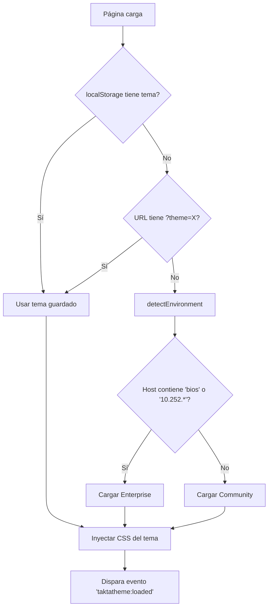

# Theme Manager System

> **Versión**: 1.0  
> **Fecha**: 2026-02-04  
> **Estado**: Especificación

---

## 🎯 Objetivo

Sistema de gestión de temas que permite alternar entre dos variantes de diseño:

| Variante | Framework | Estética | Infraestructura |
|----------|-----------|----------|-----------------|
| **Community** (Open Source) | TailwindCSS | Glassmorphism moderno | Local/On-Premise |
| **Enterprise** (Grupo BIOS) | Bootstrap 5 + Bios Design System | Corporativo | Windows Server + IIS |

---

## 🏗️ Arquitectura

```
frontend/
├── themes/
│   ├── theme-manager.js      # Core - Detección y carga dinámica
│   ├── theme-config.json     # Configuración de temas
│   │
│   ├── community/            # Tema Open Source
│   │   ├── tailwind.min.css  # Bundled localmente
│   │   ├── glassmorphism.css # Efectos blur/glass
│   │   └── components.css    # .tk-btn, .tk-card, etc.
│   │
│   └── enterprise/           # Tema Grupo BIOS
│       ├── bios-adapter.css  # Mapeo tk-* → gb-*
│       └── layout-wrapper.js # Inyección navbar/sidebar
```

---

## 🔧 Tecnología

### Community (Open Source)
- **Build Tool**: **Vite** (Development Server, HMR, Optimized Bundling)
- **CSS Framework**: TailwindCSS (via PostCSS/Vite)
- **JS Framework**: Vanilla JS (Modern ES Modules)
- **Iconos**: Heroicons (SVG inline)
- **Fuente**: Inter (Google Fonts o local)

### Enterprise (Grupo BIOS)
- **Build**: Vite (Build mode para producción) -> `dist/`
- **CSS Framework**: Bootstrap 5 + Bios Design System
- **CDN**: `/Bios_apps/cdn/design-system/...` (solo accesible en red BIOS)
- **Iconos**: FontAwesome + PE7S
- **Fuente**: DM Sans

---

## 🔌 API del ThemeManager

```javascript
// Inicialización (auto-detecta tema)
TaktaTheme.init();

// Cambiar tema
TaktaTheme.set('community');  // Tailwind + Glass
TaktaTheme.set('enterprise'); // Bios Design System

// Obtener tema actual
const current = TaktaTheme.get(); // 'community' | 'enterprise'

// Detectar ambiente (para auto-selección)
TaktaTheme.detectEnvironment(); 
// Retorna 'enterprise' si window.location.host incluye 'bios' o '10.252.*'
// Retorna 'community' en cualquier otro caso
```

---

## 🎨 Clases Abstractas

Todos los componentes usan clases `tk-*` que el ThemeManager traduce:

| Clase Takta | Community (Tailwind) | Enterprise (BIOS) |
|-------------|---------------------|-------------------|
| `.tk-btn-primary` | `bg-teal-600 hover:bg-teal-700 text-white` | `.btn.btn-gb-petroleo1` |
| `.tk-btn-success` | `bg-emerald-500 text-white` | `.btn.btn-gb-verde` |
| `.tk-btn-warning` | `bg-amber-500 text-black` | `.btn.btn-gb-naranja` |
| `.tk-card` | `bg-white rounded-xl shadow-lg` | `.card.card-gb` |
| `.tk-card-glass` | `glass backdrop-blur-md` | `.card.card-gb` (sin glass) |
| `.tk-input` | `border-gray-300 rounded-lg` | `.form-control` |
| `.tk-table` | `divide-y divide-gray-200` | `.table.table-striped` |

---

## 🚀 Flujo de Carga



---

## 📦 Distribución

### Para Repositorio Open Source
```
dist/
├── takta.community.min.css  # Tailwind + Glass + Componentes
├── takta.community.min.js   # Theme Manager configurado para community
└── assets/
    └── fonts/inter.woff2
```

### Para Despliegue Grupo BIOS
```
# No se incluyen assets CSS (se usa CDN corporativo)
dist/
├── takta.enterprise.min.js  # Theme Manager configurado para enterprise
└── layout-wrapper.js        # Inyección de navbar/sidebar BIOS
```

---

## ✅ Checklist de Implementación

- [ ] Crear estructura `frontend/themes/`
- [ ] Implementar `theme-manager.js`
- [ ] Compilar TailwindCSS con config personalizado
- [ ] Crear `glassmorphism.css`
- [ ] Crear adaptador para Bios Design System
- [ ] Crear página demo para testing visual
- [ ] Documentar en README del frontend
