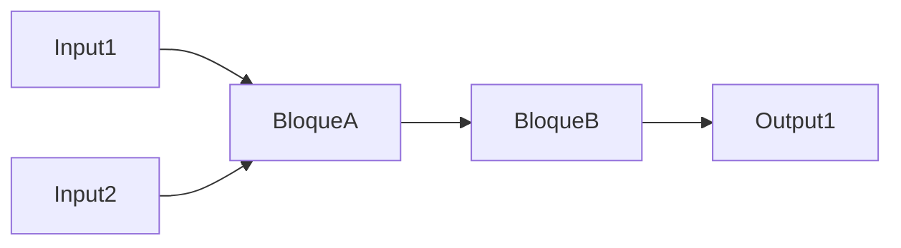

# Diagrama de Bloques Funcional

## Metadatos
- **Código Formato**: BPM-05
- **Sistema/Módulo**: {{system_name}}

## Diagrama
> Representar los bloques principales y sus interconexiones (Inputs -> Bloque -> Outputs).

## Descripción de Bloques

| Bloque | Función Principal | Entradas Clave | Salidas Clave |
|--------|-------------------|----------------|---------------|
| Bloque A | | | |
| Bloque B | | | |
