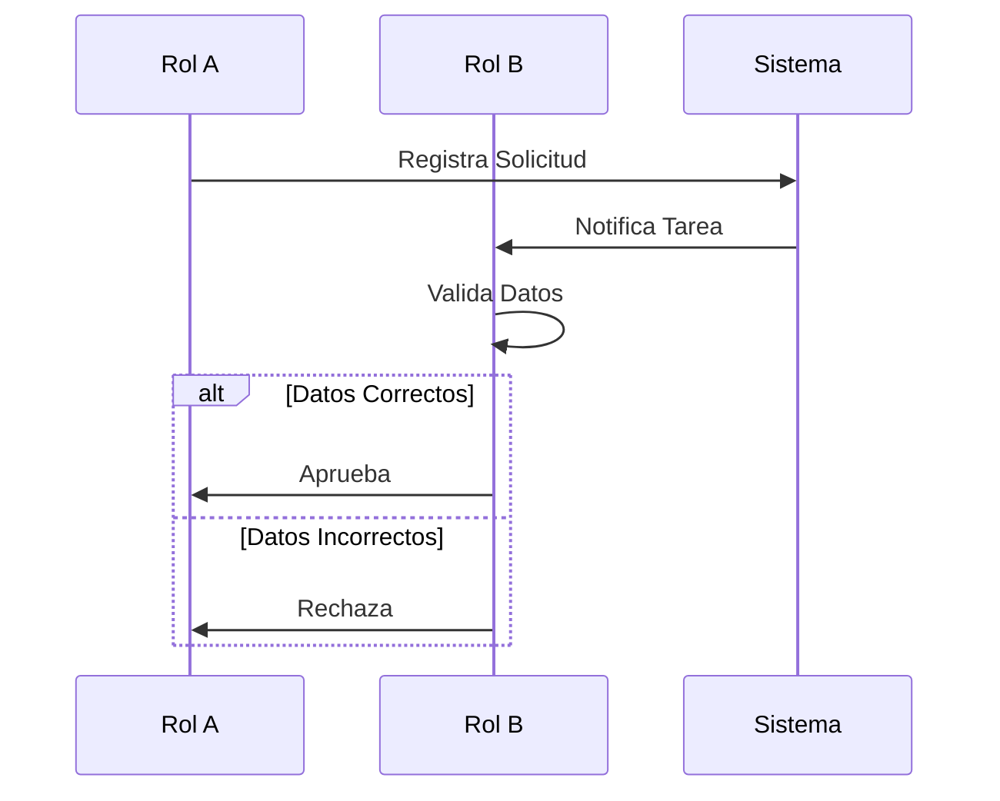

# Swimlane Diagram (Diagrama de Carriles)

## Metadatos
- **Código Formato**: BPM-06
- **Proceso**: {{process_name}}

## Diagrama
> Definir los roles (carriles) y el flujo entre ellos.

## Detalles de Interacción

| Paso | Rol Responsable | Acción | Herramienta/Sistema |
|------|-----------------|--------|---------------------|
| 1 | Rol A | | |
| 2 | Sistema | | |
